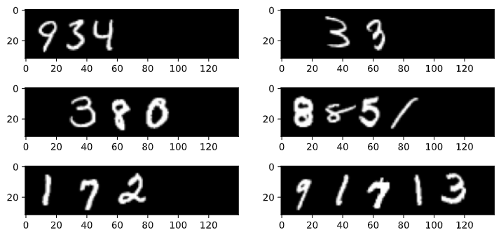
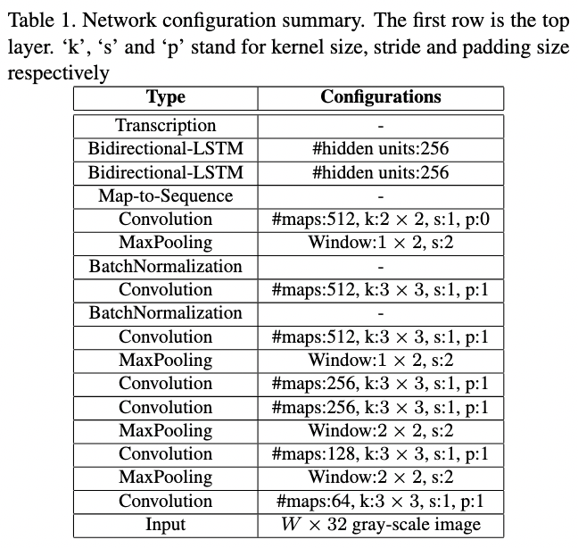

# Handwritten Digit String Recognition

## Background

In this project, I built a model to perform handwritten digit string recognition using synthetic data generated by stitching digits from the MNIST dataset:



I replicated the CRNN model proposed in [Shi, Bai & Yao (2015)](https://arxiv.org/pdf/1507.05717.pdf), which achieved a test character error rate of 0.0114 and a test accuracy of 0.9865 (see the best run [here](https://wandb.ai/kingyiusuen/handwritten-digit-string-recognition/runs/3r47q0f5/)).



I also created a Streamlit app, during which I learned some nuances involved in transferring image data from frontend to backend.


## Setup

Create a virtual environment.

```
make venv
```

Install dependencies.

```
make install-dev
```

## Usage

### Run an experiement 

Example command to run an experiment:

```
python scripts/run_experiment.py \
    trainer.gpus=1 trainer.max_epochs=100 trainer.auto_lr_find=True \
    data.batch_size=128 data.num_workers=2 data.pin_memory=True \
    data.num_train=20000 data.num_val=2000 data.num_test=2000
```

Running `scripts/run_experiment.py` will download the MNIST dataset,  generate a synthetic dataset and train a CRNN model. The best model checkpoint will be uploaded to Weights & Biases (W&B) automatically (you will be asked to register or login to W&B before the training starts).

Configurations can be modified in `config.yaml` or in command line. See [Hydra's documentation](https://hydra.cc/docs/intro) to learn more.

Example command to download a trained model checkpoint from W&B

```
python scripts/download_checkpoint.py RUN_PATH
```

Replace RUN_PATH with the path of your run. The run path can be found in the W&B dashboard and should look something like `kingyiusuen/handwritten-digit-string-recognition/3r47q0f5`

### Serverless API

Build a Docker image for AWS Lambda:

```
docker build -t handwritten-digit-string-recognition/serverless_api -f serverless_api/Dockerfile .
```

Run the Docker image:

```
docker run -p 9000:8080 -it --rm handwritten-digit-string-recognition/serverless_api
```

Example command to test the API locally:

```
curl -X POST "http://localhost:9000/2015-03-31/functions/function/invocations" -H 'Content-Type: application/json' -d '{ "image": "data:image/png;base64,'$(base64 -i images/test_image.png)'" }'
```

I didn't actually upload the Docker image to AWS (because I didn't want to pay). I only created this for practice.

### Server API

Start the API server:

```
uvicorn server_api.api:app --host 0.0.0.0 --port 5000 --reload
```

Build a Docker image for the API:

```
docker build -t handwritten-digit-string-recognition/server_api -f server_api/Dockerfile .
```

Run the Docker image:

```
docker run -p 5000:5000 -it --rm handwritten-digit-string-recognition/server_api
```

Example command to test the API locally:

```
curl -X POST "http://0.0.0.0:5000/predict" -H 'Content-Type: application/json' -d '{ "image": "data:image/png;base64,'$(base64 -i images/test_image.png)'" }'
```

### Streamlit

Run Streamlit app:

```
streamlit run streamlit/app.py
```

The app requires a running server API to work.

## Acknowledgements

[Full Stack Deep Learning Spring 2021 Labs](https://github.com/full-stack-deep-learning/fsdl-text-recognizer-2021-labs/tree/main)